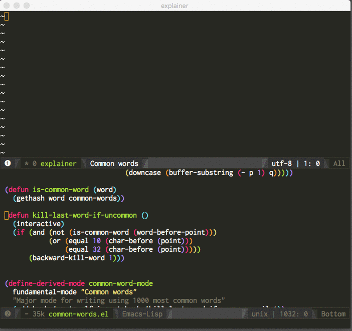

# my ~/etc directory

This is where I keep some of my config files, and some emacs lisp files.

## law: link types in org-mode
When using the spacemacs.el file, a new link type will be available in org-mode.

For example: typing [law:ORS/93.850](http://www.oregonlaws.org/ors/93.850) will 
automatically link it to the relevant page on oregonlaws.org.

Typing [law:USC/12/2605](https://www.law.cornell.edu/uscode/text/12/2605) will 
automatically link to the relevant page on cornell.edu's copy of the U.S. Code.

This is useful when taking notes that reference laws. I recently bought a house 
and it's hard to get through a single page without some specific law being referenced.

## common-words.el

This is my first [major mode](https://www.gnu.org/software/emacs/manual/html_node/emacs/Major-Modes.html) for emacs. 
It was inspired by Randall Munroe's [Thing Explainer](https://xkcd.com/thing-explainer/) and Morten Just's [editor that 
doomed humanity](https://medium.com/@mortenjust/i-doomed-mankind-with-a-free-text-editor-ba6003319681#.utnh5bpjh).

The concept is simple, restrict your vocabulary to the 1000 most common words. If you can explain something using this 
reduced vocabulary, then you really understand the topic. This is a decent test of understanding because it's easy to 
learn a word, and even use that word in the right context, but still have no idea how it relates to other things.

This is not to say that specialized vocabulary is bad, it's quite useful for communicating between people with a lot of 
shared context. But when explaining things to people without that context, it's important to be able to expand jargon words
into common words, even if it results in a larger, slightly less accurate version.

Here is an animation of the editor mode in action:

